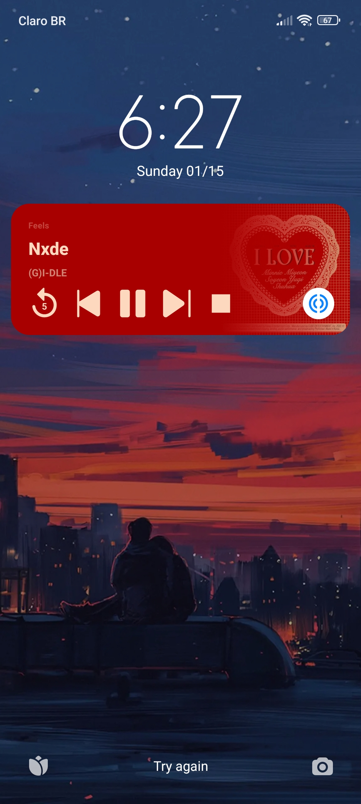

# Feels
An android music app

&nbsp;
 &nbsp;
 &nbsp;

## Download
[Click here to download the latest version](https://github.com/PHSSGG/Feels/releases/latest)

## Features
- Song search
- Download songs
- Recommendations based on user preferences
- Create playlists
- Expandable bottom player controller
- Player controls such as Shuffle and Repeat
- Player notification
- Support for English, Portuguese, Spanish, Italian, German, Russian, French, Chinese, Korean and Japanese

## Screenshots

 

 

## Contributing and support
Contact me by email at [pedrohddgd@gmail.com](mailto:pedrohddgd@gmail.com?subject=Feels)

Did you find any bug? [Open an issue](https://github.com/PHSSGG/Feels/issues)
All contributions are always welcome, make a PR or open an issue to do a suggestion.

## Acknowledgements
- [SDP](https://github.com/intuit/sdp)
- [youtubedl-android](https://github.com/yausername/youtubedl-android)
- [Circular floating action button](https://github.com/DmitryMalkovich/circular-with-floating-action-button)
- [Koleton](https://github.com/ericktijerou/koleton)

## License
This project is licensed under The `GNU General Public License v3.0`.
Check [LICENSE.md](/LICENSE) for more info about.
